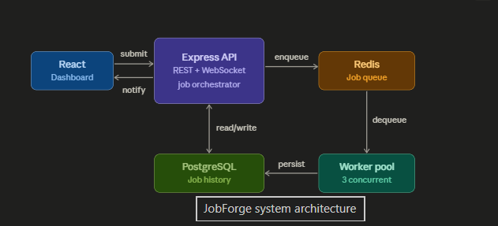

# JobForge — Distributed Task Queue System

A production-grade background job queue built with Node.js, Redis, PostgreSQL, and React.

## System Architecture

### Architecture Flow

1. React dashboard submits jobs to the Express API.
2. Express validates and stores metadata in PostgreSQL.
3. Jobs are pushed into Redis queues.
4. Worker pool consumes jobs concurrently.
5. Results and status updates are persisted in PostgreSQL.
6. API notifies the dashboard through WebSockets.

## What it does

- Queue async jobs (emails, reports, image processing, etc.)
- Priority-based processing (HIGH / MEDIUM / LOW)
- Automatic retry with exponential backoff
- Real-time dashboard showing job status
- Dead Letter Queue for failed jobs

## Tech Stack

- **Backend:** Node.js, Express.js, Redis, PostgreSQL
- **Frontend:** React.js, WebSocket (Socket.io)
- **Deployment:** AWS EC2

## Getting Started

npm install

npm run dev
